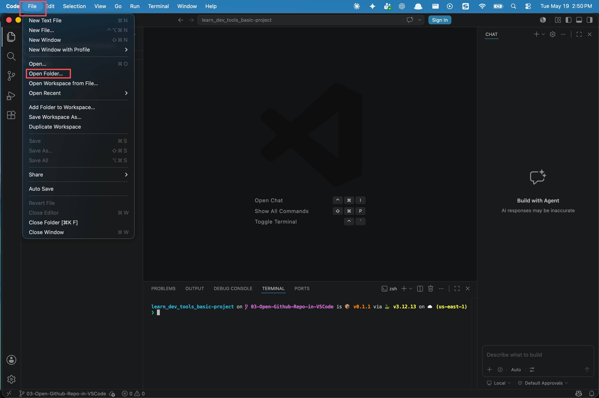
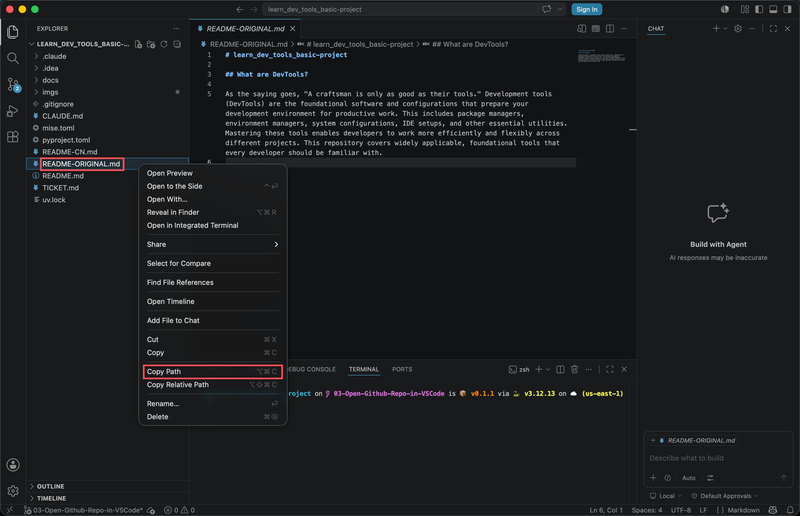
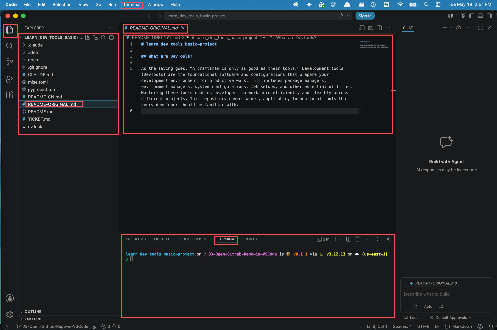

# VSCode 极简指南, 为 AI 打造的文件管理中枢

> 一句话说明这个 Task 教什么: 把 VS Code 当作文本编辑器加 AI 助手, 而不是代码编辑器, 学会用它管理文件, 把具体的编辑工作交给 AI.

## 1. 概览

你可能听过 VS Code, 也可能以为它是专门给程序员写代码用的. 其实不是. 在这门课接下来的学习中, VS Code 的真正价值是: 成为你和 AI 之间沟通的桥梁.

想象一下这样的工作流: 你打开一个文件夹, 也就是你的项目; 用鼠标快速找到某个文件, 复制它的路径; 把这个路径告诉 AI, 请帮我编辑这个文件; AI 根据路径准确找到文件, 进行修改; 你用 GitHub Desktop 保存这些更改.

这就是现代工作方式: 人类做决策和指导, AI 做具体的文件操作. 我们先掌握这个基础, 至于写代码这件事, 那是以后需要的时候再学.

> **关于下面的截图:** 截图里的 VS Code 版本和界面细节, 可能和你现在打开的不完全一样, 菜单文字或按钮位置偶尔会变. 不用纠结这些字面上的差异, 看懂截图想说明的概念就够了, 真遇到界面对不上的地方, 照第 10 节说的, 截个图问 AI 就行.

---

## 2. 学习目标

学完这个 Task, 你将能够:

1. 在 VS Code 里打开任意一个项目文件夹
2. 用 `Cmd + P` 快速搜索并打开文件
3. 用右键 Copy Path 复制任意文件的完整路径, 这是和 AI 沟通的共同语言
4. 打开一个文件, 做一个小改动并保存
5. 打开 VS Code 的集成终端, 为将来用 Claude Code, Codex CLI 这类 coding agent 做准备

---

## 3. 前置知识

- 完成了上一个 Task, VS Code 已经装好
- 用 GitHub Desktop clone 过至少一个项目到本地, 或者知道怎么现场 clone 一个

---

## 4. 打开一个文件夹, 定义你的工作区

VS Code 最核心的概念是 Project, 项目, 其实就是一个文件夹. 这一点很重要, 因为 AI 需要知道你在处理的是哪个项目. 一个文件夹通常对应一个 GitHub 仓库. 当你打开一个文件夹作为项目后, VS Code 会显示这个文件夹里的所有文件和子文件夹, 形成一个清晰的目录树.

这样做的好处是: 你能一目了然地看到项目的整个结构; 当你告诉 AI 请编辑某个文件时, AI 可以在这个上下文中准确理解你的指令; 你随时可以快速浏览和找到任何文件.

打开方法:

1. 打开 VS Code
2. 点击菜单 `File` 到 `Open Folder`
3. 选择你的项目文件夹, 比如你从 GitHub Desktop clone 下来的代码仓库
4. 完成, 这个文件夹现在就是你的工作区间, 左边的文件树会显示所有内容



---

## 5. 打开 VS Code 的集成终端, 为将来做准备

VS Code 有一个很多人都没留意的功能: 集成终端 (integrated terminal). 打开菜单 `Terminal` 到 `New Terminal`, 或者按快捷键 `` Ctrl + ` ``, 编辑器下方就会出现一个终端窗口. 这和你在上一个 Task 里用 Ghostty 或系统自带 Terminal 打开的其实是同一个东西, 只是现在它嵌在 VS Code 里面, 而且默认就停在你当前打开的这个项目文件夹里.

试着在这个集成终端里输入 `pwd`, 你会看到它显示的正是你在 VS Code 左边文件树里打开的那个文件夹, 而不是随便什么地方. 这就是集成终端相比单独开一个 Terminal 窗口的好处: 不用手动 `cd` 过去, 项目一打开, 终端自动就跟到了这个项目里.

**为什么现在就要熟悉这个.** 以后你会用到 Claude Code, Codex CLI, Antigravity CLI 这类 coding agent, 它们首先都是命令行程序, 需要在一个终端窗口里输入命令来启动. 最自然的地方就是 VS Code 的这个集成终端: 项目开着, 文件树看得见, agent 就在同一个窗口里跑, 它改了什么你当场就能看到. 这个 Task 不会教你怎么用这些 coding agent, 但提前打开它, 熟悉它长什么样, 会让你以后上手快很多.

---

## 6. 复制文件路径, 告诉 AI 我要改这个

这一步是整个工作流的关键. 当你要让 AI 修改某个文件时, 不能模糊地说改一下那个文件, AI 需要一个精确的地址, 完整的文件路径. 比如你想修改一个配置文件, 需要告诉 AI:

```text
/Users/yourname/Documents/GitHub/my-project/config.json
```

而不是改一下 config 文件.

最简单的方法: 右键点击文件, 选择 `Copy Path`, 这样就会自动复制完整路径到剪贴板, 然后直接粘贴给 AI. 这是你和 AI 之间最高频的交互.



因为这是让 AI 精确操作你的文件的唯一方式. 没有准确的路径, AI 就不知道你想改哪个文件. 掌握这个操作, 相当于掌握了和 AI 沟通的共同语言.

---

## 7. 搜索文件, 快速定位

项目中的文件很多, 你不可能记住每个文件的位置, 所以最重要的技能是快速搜索.

在 VS Code 中按下 `Cmd + P`, 或点击左上角的搜索图标, 然后输入文件名的一部分. 比如你想找 `config.json`, 就输入 config, VS Code 会立刻显示所有包含 config 的文件.



这样做能节省时间, 不用在文件树里一层层点击; 也能减少错误, 快速找到正确的文件, 避免改错了位置. 当你告诉 AI 想在 config 文件里加一行时, 你自己先找到对应的文件, 才能准确地告诉 AI 要改哪个.

---

## 8. 常见的文件操作

当你日常使用 VS Code 时, 这些操作会频繁出现:

| 操作 | 方法 | 为什么有用 |
| :--- | :--- | :--- |
| 打开文件 | 双击左边的文件树 | 查看文件内容, 确认要改什么 |
| 编辑文件 | 打开文件后直接输入 | 做快速的小改动 |
| 保存文件 | `Cmd + S` | 确保修改被保留 |
| 删除文件 | 右键到 Delete | 清理不需要的文件 |
| 移动文件 | 右键到 Move | 重新组织项目结构 |
| 重命名 | 右键到 Rename, 或双击文件名 | 改变文件名, 保持项目清晰 |
| 复制路径 | 右键到 Copy Path | 最关键, 告诉 AI 要改哪个文件 |
| 在文件间切换 | 点击上方的标签页 | 在多个文件之间快速切换 |

有时你不仅要找到文件, 还要在文件内容里搜索特定的词. 按 `Cmd + F` 打开查找功能; 如果要替换内容, 按 `Cmd + H` 打开查找和替换, 可以一次性改多个地方.

---

## 9. 三工具的协作, 完整的工作流程

VS Code 不是独立工作的, 它是和 GitHub Desktop 配合的. 完整的工作流程是这样的:

1. GitHub Desktop: 用它来 clone 项目到你的电脑, 比如从 `Documents/GitHub/` 文件夹下载下来
2. VS Code: 打开这个文件夹, 左边的文件树显示了整个项目的结构
3. 你: 浏览文件, 找到想修改的地方, 复制它的路径
4. AI, 通过 Claude Code 这类工具: 把路径告诉 AI, AI 根据路径找到文件并进行修改
5. GitHub Desktop: 修改完成后, 用它提交并推送更改回到 GitHub

这个工作流的美妙之处在于, 人类做决策, AI 做执行. 你只需要说我想改这个文件, AI 就能精确地找到它, 修改它.

---

## 10. 遇到不会的 VS Code 操作, 怎么办

VS Code 的功能远不止上面这几项, 调试器, 扩展, 主题, 快捷键, 都可以以后慢慢学, 不需要一开始就全学. 更实用的做法是: 遇到不确定该怎么操作的地方, 直接截一张屏幕的图, 描述你想要的效果, 交给你的 AI agent 问. 比如:

> 我在用 VS Code 管理一个项目文件夹, 附上一张截图. 我想实现 [描述你想做的事情, 比如把某个设置改掉, 或者装一个某功能的扩展]. 请告诉我具体点哪里, 每一步截图里对应的位置在哪.

这门课接下来遇到的很多小工具配置, 都可以用这个方式解决: 截图加描述, 让 AI 现场教你, 而不是等一份写好的教程.

---

## 11. 核心理念, 正确理解 VS Code 的角色

很多人学 VS Code 时会陷入一个误区, 觉得它是代码编辑器, 所以要学会在里面写代码. 其实在这个阶段, 你需要理解的是: VS Code 是信息管理工具, 帮你浏览, 查找, 组织文件; 文件路径是沟通工具, 你通过路径告诉 AI 请改这个地方; 右键 Copy Path 是最高频操作, 这是你和 AI 沟通的方式.

一个重要的观点是: 文件管理和代码编写是两个不同的能力. 文件管理是知道文件在哪里, 怎么改, 怎么保存; 代码编写是知道怎么写出能工作的代码. 在 AI 时代, 这两个能力的重要性反过来了, 文件管理变得更重要, 因为你需要精确地告诉 AI 改这个文件; 代码编写变得不那么重要, 因为 AI 可以帮你写代码.

写代码这件事, 我们以后再学. 现在, 先掌握如何让 AI 接管你的文件操作.

---

## 12. 练习

### 练习 1: 打开项目, 复制三次路径, 搜索三次文件

**目标:** 熟练到不用思考就能完成打开文件夹, 复制路径, 搜索文件这三个动作.

**怎么做:**

1. 在 VS Code 里打开一个项目文件夹, 比如你用 GitHub Desktop clone 下来的仓库
2. 找三个不同的文件, 分别右键 Copy Path, 把路径粘贴到一个笔记里, 确认能看懂路径的含义
3. 用 `Cmd + P` 搜索三次, 每次搜不同的文件名片段
4. 打开任意一个文本文件, 做一个小改动, 用 `Cmd + S` 保存, 确认标签页上的圆点消失
5. 用 `` Ctrl + ` `` 打开集成终端, 输入 `pwd`, 确认显示的正是当前项目文件夹

**你会观察到:**

熟练之后, 从打开文件夹到拿到一个文件的完整路径, 整个过程只需要几秒钟.

> **关键洞见:** 复制路径这个动作看起来很小, 但它是你和 AI 之间最高频的交互, 值得练到肌肉记忆.

---

## 13. 回顾: 我们学到了什么

- VS Code 在这门课里的角色是文件管理工具, 是你和 AI 之间的沟通桥梁, 不是代码编辑器
- 打开文件夹, 复制路径, 搜索文件, 这三个动作是核心技能
- 集成终端让你不用手动 `cd`, 项目一打开终端就跟着到位, 这也是将来运行 coding agent 的地方
- 完整的工作流程是 GitHub Desktop clone, VS Code 定位文件, AI 执行修改, GitHub Desktop 提交
- 遇到教程没覆盖的 VS Code 操作, 截图加描述交给 AI, 比自己摸索更快

---

## 14. 导师寄语

**为什么这个练习重要:**

当我们说学 VS Code 时, 很多人以为要学会在里面编程, 于是陷入麻烦, 去学快捷键, 学插件, 学各种高级功能, 结果被吓怕了. 但这是错的方向. 这门课要建立的心智模型只有一个: VS Code 是人和 AI 沟通的媒介. 需要学会的技能非常有限, 打开一个文件夹, 快速搜索文件, 复制文件路径, 打开集成终端, 就这几个.

**关键洞见:**

- 文件管理和代码编写是两种不同的能力, 在 AI 时代前者的重要性反而上升了
- 这个课程是一个垫脚石, 学会了这个, 你就可以立刻开始和 AI 协作, 让它帮你创建新文件, 修改配置, 编写文档

**下一步:**

当你真的需要写代码时, 比如以后学 Python, VS Code 只是你已经熟悉的工具, 不是新的挑战. 接下来你可以自己尝试这样的工作流: 打开一个项目文件夹, 复制某个文件的路径, 告诉 AI 请帮我编辑这个文件, 我想改, 看着 AI 精确地修改你指定的文件, 用 GitHub Desktop 保存这个改动.

---

## 15. 速查

**核心快捷键:**

| 快捷键 | 作用 |
| :--- | :--- |
| `Cmd + P` | 按文件名搜索并打开文件 |
| `Cmd + S` | 保存当前文件 |
| `Cmd + F` | 在当前文件里查找 |
| `Cmd + H` | 在当前文件里查找并替换 |
| `` Ctrl + ` `` | 打开或关闭集成终端 |

**关键操作:**

- 打开项目: `File` 到 `Open Folder`
- 复制路径: 右键文件到 `Copy Path`
- 打开集成终端: `Terminal` 到 `New Terminal`
